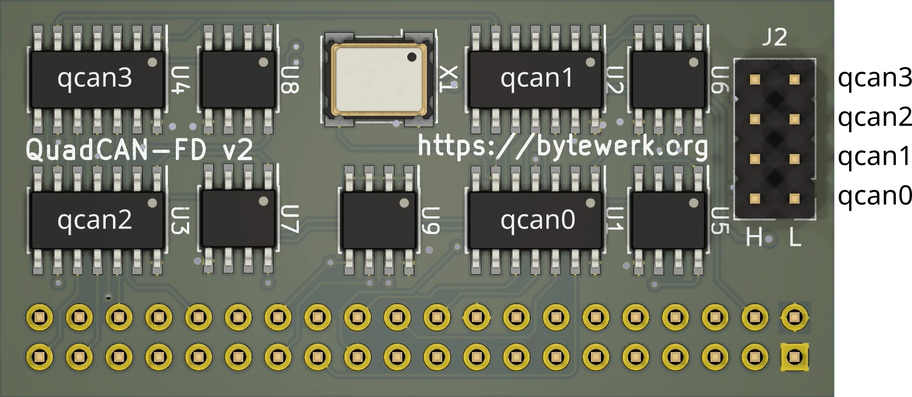

# ArchQuadCAN-FD

ArchlinuxARM on Raspberry Pi [QuadCAN-FD Hat](https://github.com/Bytewerk/QuadCAN-FD) with 4x CAN-FD interfaces.

| **iface** | **SPI** | **CS** | **IRQ** |
|-----------|---------|--------|---------|
| qcan0     | spi0    | GPIO7  | GPIO4   |
| qcan1     | spi0    | GPIO8  | GPIO2   |
| qcan2     | spi1    | GPIO18 | GPIO13  |
| qcan3     | spi1    | GPIO17 | GPIO6   |

## Build and deploy ArchQuadCAN-FD image on Raspberry Pi
Ensure the following dependencies are installed on your system before building:
- `arch-chroot`
- `qemu`
- `binfmt_misc`

Build and deploy image with following steps:
1. run `./build.sh` to download and build configured image
2. insert SD card to computer
3. run `sudo ./write_sdcard.sh /dev/mmcblkX`, this step will also copy `~/.ssh/id_rsa.pub` to the image for ssh key-authentication
4. insert SD card to Raspberry Pi and power it on
5. connect via `ssh root@archquadcan-fd.local`

